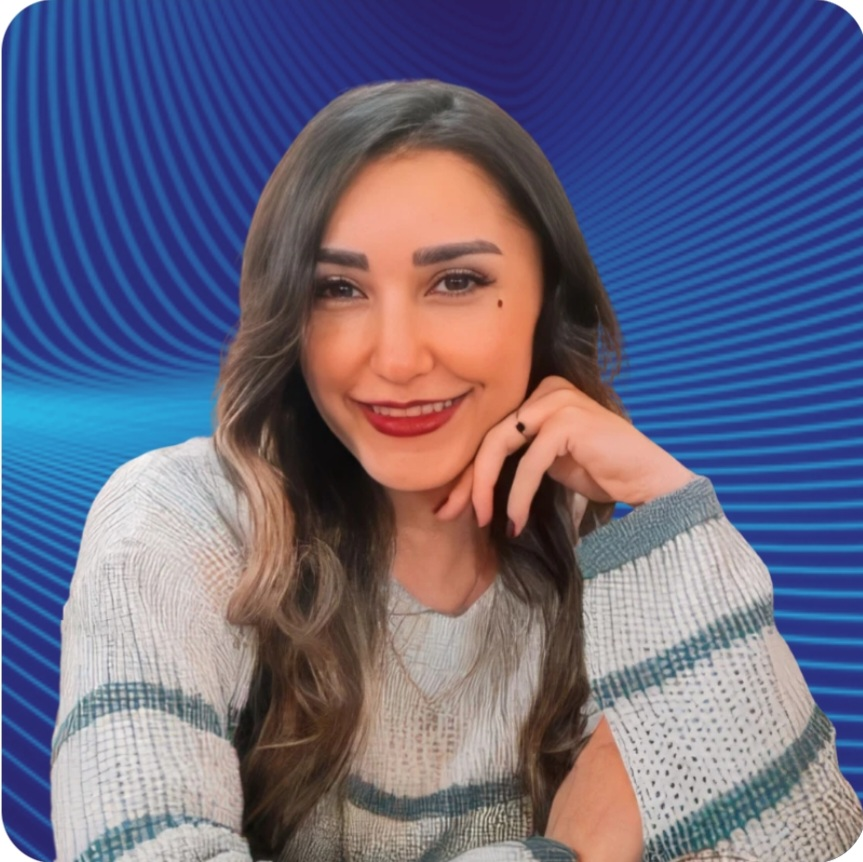

# Maral Karbaschi

### Mathematical Statistics · Machine Learning · Deep Learning · Reinforcement Learning

Researcher in statistical learning, healthcare AI, intelligent systems, and adaptive machine learning.

 

---

## About Me

I am an M.Sc. graduate in Mathematical Statistics with research interests in:

- Machine Learning
- Deep Learning
- Reinforcement Learning
- Statistical Learning
- Healthcare AI
- Clinical Risk Analytics
- Intelligent Adaptive Systems
- Imbalanced Data Analysis

My work focuses on combining statistical reasoning and machine learning methodologies for intelligent and data-driven systems.

---

## Current Research Directions

🧠 Uncertainty-aware statistical learning for healthcare analytics

⚡ Reinforcement learning for resilient intelligent systems

📊 Machine learning for imbalanced and high-dimensional data

🔬 Adaptive analytics and intelligent monitoring systems

---

## Academic Activities

- 🎤 Speaker — Healthcare Applied AI Summit 2026
- 📄 ICORS 2026 Abstract Submission
- 👩‍💻 Member — Women in AI
- 🧠 Member — IEEE EMBS BIIP Technical Committee

---

## Technical Skills

---

## GitHub Stats

 

---

## Academic Website

🌐 https://mari94k.github.io
